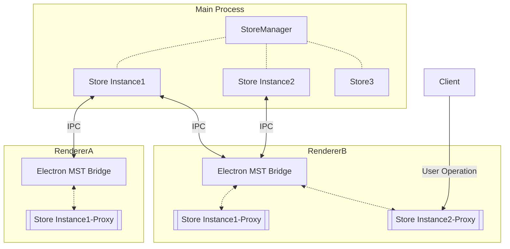

# Electron-MST

`electron-mst` is a end-to-end electron state management to synchronization status across multiple electron processes, powered by mobx-state-tree.

You can use `electron-mst` with a a simple and elegant way like using mobx. 

You also can use `mobx-state-tree` together with React, or with any other view library.


## ✨Installation

> Generally, your packageManager you help auto install the peerDependencies. (electron & mobx-state-tree)

```sh
# with yarn
yarn add electron-mst

# with pnpm
pnpm install electron-mst
```


## 👀 Overview

📦 Ready out of the box  
🎯 Based on the official [mobx-state-tree](https://mobx-state-tree.js.org/), api will be familiar to you if you have used MST  
🌱 High cohesion & Low coupling; Highly readable  
💪 Inter-Process Communication is aided by Electron's native ipc channel, which supports preload's sandbox mode by default  
🖥 Supports the creation of multiple MST stores and MST Store nesting 


## 🌱 React Demo

> demo boilerplate power by `electron-vite`

```sh
# clone the project
git clone https://github.com/BanShan-Alec/electron-mobx-state-tree

# enter the project directory
cd electron-mobx-state-tree

# install dependency
pnpm install

# try it by yourself
pnpm run dev
```


## ⚙️Documentation

### Basic Example

#### Step0: expose electron-mst bridge

```ts
// electron/preload/index.ts
import { exposeMSTBridge } from 'electron-mst/preload';

exposeMSTBridge();
```

#### Step1: decalre a model & create store

```ts
// shared/store/user.ts
import { createStore } from 'electron-mst';
import { types } from 'mobx-state-tree';

export const UserStore = types
    .model({
        name: types.string,
        age: types.number,
    })
    .views((ctx) => {
        return {
            get isAdult() {
                return ctx.age >= 18;
            },
        };
    })
    .actions((ctx) => {
        return {
            updateName(name: string) {
                ctx.name = name;
            },
            updateAge(age: number) {
                ctx.age = age;
            },
        };
    });

export const user$ = createStore(UserStore, {
    name: 'Jack',
    age: 18,
});
```

#### Step2: init sdk in main process

```ts
// electron/main/index.ts
import { initMST } from 'electron-mst/main';
import { UserStore } from '@/shared/store/user';

initMST([
    {
        store: UserStore,
    },
]);
```

#### Step3: use Store Instance in renderer

```tsx
// src/App.tsx
import React from 'react';
import { useEffect, useState } from 'react';
import logoVite from './assets/logo-vite.svg';
import logoElectron from './assets/logo-electron.svg';
import './App.css';
import { observer } from 'mobx-react-lite';
import { user$ } from '@/shared/store/user';

let App = (props: IProps) => {
    const {} = props;
    const { age, updateAge } = user$;

    const handleCreateWindow = (e: any) => {
        // self-realization...
    };

    useEffect(() => {
        // watch state change in React
        console.log("age changed", age)
    }, [age]);

    return (
        <div className="card">
            <code>{JSON.stringify(user$, null, 2)}</code>
            <button
                onClick={() => {
                    // invoke action
                    updateAge(age + 2);
                }}
                >
                Update User
            </button>
        </div>
    );
};

interface IProps {}

App = observer(App);
export default App;

```

Step4: new another window to view the user$

> You can view the user$ state has sync automatically between two Renderer


### More Example

> The Basic Example show us how to init `electron-mst` & create a mst stroe & use store in renderer.
>
> If I want to use mst store in main process .What should I do?

#### Use In Main Process

> Base on the `basic Example`，you just need to change the `step2`
>
> `createStoreBefore: true` is the key flag.

```ts
// electron/main/index.ts
import { app, BrowserWindow, shell, ipcMain } from 'electron';
import { initMST, getStore Instance } from 'electron-mst/main';
import { UserStore } from '@/shared/store/user';
import { autorun, reaction } from 'mobx';

initMST([
    {
        store: UserStore,
        snapshot: {
            name: 'Jack',
            age: 18,
        },
        createStoreBefore: true,
    },
]);

function createWindow() {...}

app.whenReady().then(() => {
    createWindow();
    // Get Store Instance (after intMST done)
    const user$ = getStore Instance(UserStore);

    // watch store change
    reaction(
        () => user$.age,
        (newVal, oldVal) => {
            console.log(`user.count oldVal ${oldVal} -> newVal ${newVal}`);
        }
    );
    autorun(() => {
        console.log('user$.age', user$.age);
        if (user$.age > 30) {
            // invoke action, will auto sync to other process
            user$.updateName('Tom');
        }
    });
});
```


## 🎯Realize & Design



## ❔ FAQ

### Q1: Can I create a Store multiple times?

A1: No! Please make sure your Store create juse one time. Because `electron-mst` strongly dependent on Store’s name.
So the Store’s name cannot be repeated or empty.
